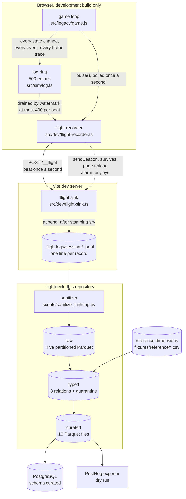
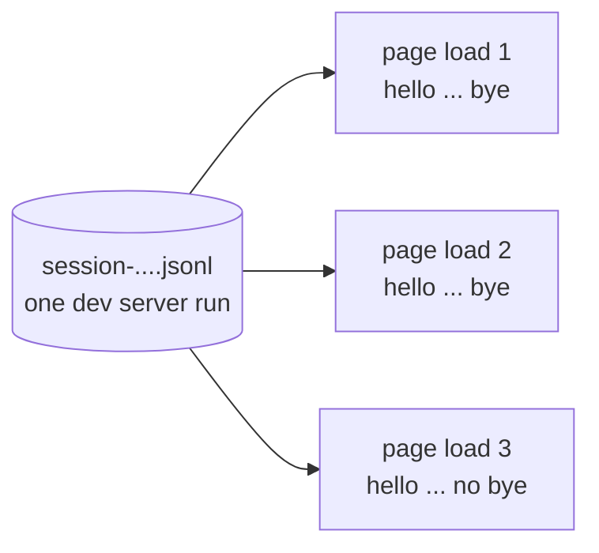
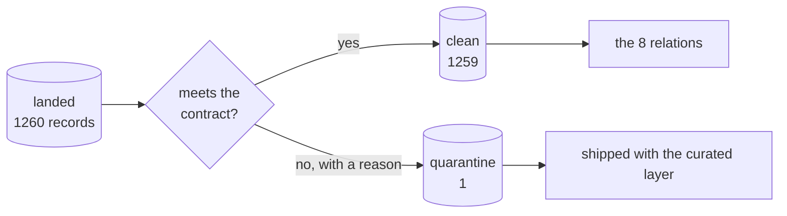
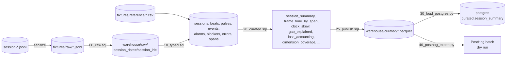

# How this works, end to end

A browser game records what it is doing. A pipeline turns that recording into
tables you can ask questions of. This page explains the whole path, from a key
press in a game to a row in PostgreSQL.

Read this first, then the code. Nothing here is aspirational, every step below
runs today with `./demo.sh`.

## The short version

| Stage | What goes in | What comes out | Where |
|---|---|---|---|
| Record | A game being played | One JSON object per second | crow-archer, in the browser |
| Land | JSONL text | Hive partitioned Parquet | `pipeline/00_raw.sql` |
| Type | Parquet, one wide row per record | Eight relations, plus quarantine | `pipeline/10_typed.sql` |
| Curate | Eight relations | Ten answers | `pipeline/20_curated.sql` |
| Publish | Ten answers | Ten Parquet files | `pipeline/25_publish.sql` |
| Load | Ten Parquet files | PostgreSQL tables | `pipeline/30_load_postgres.py` |
| Preview | The same ten files | A PostHog event batch, dry run | `pipeline/40_posthog_export.py` |

Total run time on the committed fixtures: about 3 seconds, cold.

## The whole topology



The dotted arrow matters. Beats go out with `fetch`, but an alarm, an uncaught
error and the goodbye go out with `sendBeacon`, which the browser finishes even
while the page is being torn down. Without it, the most interesting record in
any session, the one written as everything falls over, would be the one you
never receive.

## The four parts, and who owns what

| Part | Lives in | Owns |
|---|---|---|
| Recorder | crow-archer, browser | Deciding what is worth sending, and when |
| Sink | crow-archer, dev server | Stamping arrival time, appending the file. The only writer |
| Pipeline | flightdeck, this repo | Structure, contract, answers |
| Consumers | PostgreSQL, PostHog | Reading. Never writing back |

One writer per stage, in one direction. Nothing downstream can change what was
recorded, which is what makes the log worth trusting.

## The four clocks

This is the idea the whole design rests on, so it is worth being slow about.

Every record carries up to four different notions of time:

| Clock | Written by | Trustworthy? |
|---|---|---|
| `wall` | The page | No. A sleeping or throttled tab reports whatever it believes |
| `perf` | The page | No. Monotonic, but only relative to that page load |
| `timestamp` on each event | The page | No. Same reason |
| `srv` | The server, on arrival | **Yes.** The page cannot influence it |

So the pipeline partitions and orders on `srv`, and treats the other three as
things to compare against it rather than as facts.

```
   page says:  "it is now 14:58:31"          --.
                                                >-- compare these two
   server saw it arrive at:  14:58:31.009    --'
```

Two questions fall out of that comparison, and both are answered in
`pipeline/20_curated.sql`:

1. **Do the clocks agree?** Across 1259 records, `srv - wall` runs from 0 to 9
   milliseconds, mean 0.92. They agree. Now that is measured rather than assumed.
2. **When did the page go quiet, and why?** Consecutive `srv` values with a gap
   bigger than three beats. Joining each gap to the tab visibility at the time
   explains most of them, and leaves one that it cannot.

| Explanation | Gaps | Longest |
|---|---|---|
| Background tab, browser clamped the 1 second timer | 20 | 60.0s |
| Tab hidden, machine asleep | 4 | 17364.8s |
| Visible throughout, not explained by throttling | 1 | 472.2s |

Twenty gaps of almost exactly 60 seconds, every one of them while the tab was
hidden, is a browser doing exactly what browsers do. The single 472 second gap
while the tab was visible is not that, and it is the only one worth anybody's
afternoon.

## A session file is not a session

The sink writes one file per dev server run. Every page load during that run
appends to the same file. The three fixture files hold **16** page loads between
them, and event ids restart at 1 on each one.



So the file name keys nothing. The pipeline builds the real key two ways:

- If the record carries `cid`, a per page client id minted by the recorder, use it.
- Otherwise, count `hello` records seen so far in the file. That is `page_load_seq`.

The committed fixtures predate `cid`, which is why both paths exist and both are
exercised. The raw layer unions a zero row template by name so the `cid` column
is present either way, and the typed layer picks with one `coalesce` rather than
branching into two code paths.

This is also where the pipeline found something real. One fixture file opens
with a `bye`, because a page was still open when the dev server restarted, and
its goodbye landed in a file that never saw its hello. That record is an orphan
under the contract and goes to quarantine.

## The contract, and what happens to a bad row

The contract is `contracts/flight_log.yml`: which fields each record kind must
carry, which values each enum allows, and the size caps the recorder enforces.
Its enum members are also committed as CSV reference dimensions, and the caps
are a table in the warehouse, so the contract is queryable rather than buried in
code. A test asserts the copies never drift apart.



**Nothing is dropped.** A row that fails goes to `quarantine` carrying the reason
it failed, and the counts are made to reconcile in public:

```
clean 1259  +  quarantined 1  =  landed 1260      reconciles: true
```

Quarantine ships alongside the curated data on purpose. A consumer that can read
the clean rows but cannot see what was held back has no way to judge how complete
its answer is.

## Where the frame timings come from

Two places, and the difference matters.

| Origin | Rows | Shape | Good for |
|---|---|---|---|
| `alarm.trace.spans` | 24 | Already typed | Reading directly |
| Trace summary in the beat drain | 3978 | Formatted text | Percentiles |

Alarms carry a clean typed struct, but there are four alarms in the entire
fixture set, and a p95 over four samples is not a p95. The recorder also writes a
trace summary into the log ring about once a second, and that survives in the
beat drain as a line of text:

```
sim        0.05ms   max 0.70     0 fill    0 img   0.00Mpx
```

Parsing those gives 663 summaries, six sections each, 3978 measurements. The
percentiles come from those, and the sample count is printed next to them so
nobody has to take the number on faith.

## Loss accounting

The recorder drains a 500 entry ring by watermark and caps each beat at 400
events. If it ever has to discard, it says so. Two independent checks:

1. The counter the recorder itself reports.
2. Gaps in the event id sequence. Ids are assigned at the source and are
   contiguous within a page load, so a missing id is a lost event and the
   recorder cannot hide it.

Result on the fixtures: **0 lost of 2079 events**, with a peak of 32 events in a
single beat against a cap of 400, which is 8 percent of the headroom. The ring
never came close to overflowing. That is the honest finding, and the mechanism
is what makes the finding checkable.

## One curated layer, two consumers

```
   curated Parquet ---> PostgreSQL, relational tables
                   \
                    -> PostHog, an event stream
```

Both read the same files. Neither reads the DuckDB database, and neither reads
the raw log. Adding a third consumer means adding a reader, not another pipeline.

## Lineage, one raw file to one Postgres table



## Running it

| Command | Does |
|---|---|
| `./demo.sh` | Everything, timed |
| `./demo.sh build` | Raw, typed, curated, publish. No load, no exporter |
| `./demo.sh curated` | One step |
| `./demo.sh --live _flightlogs` | Read a live capture instead, newest file wins |

Live play falls back to the fixtures by omitting `--live`. There is no live only
state to unwind, which is the whole kill switch.

If the Docker daemon is not running, the load step degrades to a local target
with the same schema and announces it in capitals. A silent fallback during a
live demo would be worse than a failure.

## What the fixtures actually contain

| | Records | beat | hello | bye | alarm | err |
|---|---|---|---|---|---|---|
| Session A | 282 | 269 | 6 | 5 | 1 | 1 |
| Session B | 640 | 626 | 6 | 4 | 3 | 1 |
| Session C | 338 | 331 | 4 | 3 | 0 | 0 |
| **Total** | **1260** | **1226** | **16** | **12** | **4** | **2** |

Two of the four alarms are `loop-dead`, one `logic-freeze`, one `no-frames`. One
of the two errors is a real crash, `PathScheduler.invalidateThrough` at
`pathfinding.ts:67:30`. The other is a deliberate self-test, left in because
removing it would misrepresent the session.

See [fixtures/SANITIZATION.md](../fixtures/SANITIZATION.md) for exactly which two
fields were rewritten before these were committed, and what was checked.
