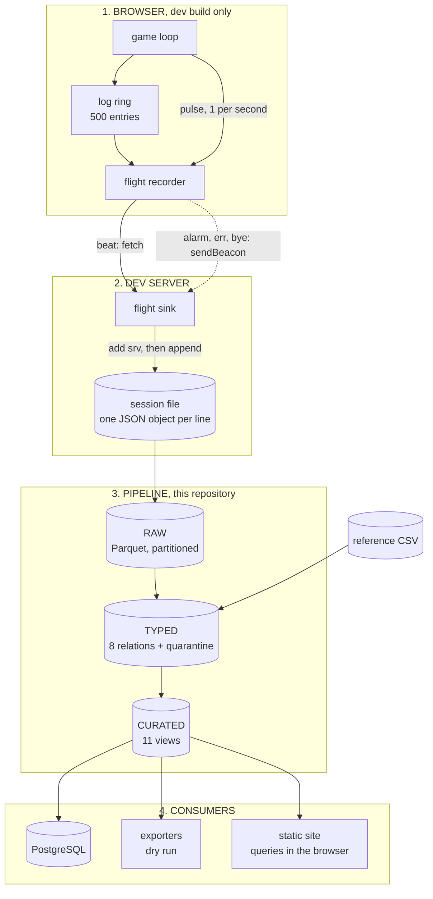
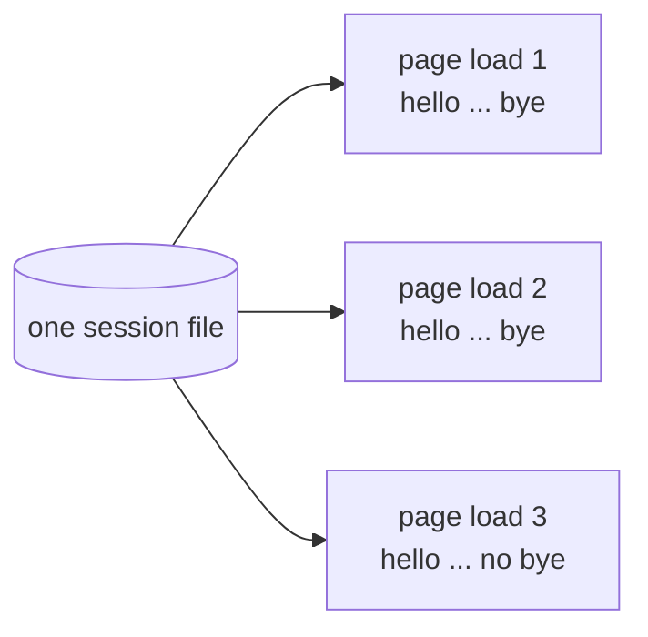
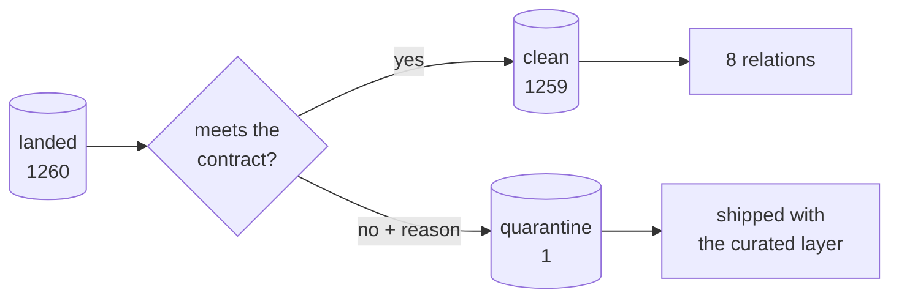
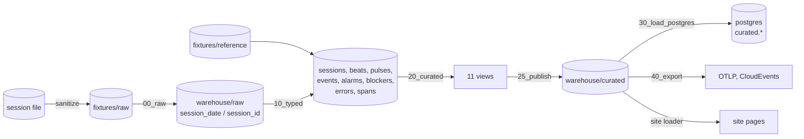

# How the system works

This page explains the system from end to end. It shows the topology, the data
flows, and the process.

Every step on this page runs today. Use `./demo.sh` to run all of them.

## Words used on this page

One word has one meaning. This table fixes each meaning.

| Word | Meaning |
|---|---|
| **record** | One JSON object. One line in a log file |
| **page load** | One browser page, from open to close |
| **session file** | One file the sink writes. One file per dev server run |
| **layer** | One stage of the pipeline: raw, typed, or curated |
| **relation** | One table or one view |
| **clock** | One source of time. The system has four |

## The system in one picture



Read the dotted arrow carefully. It is important.

- A beat uses `fetch`.
- An alarm, an error, and a goodbye use `sendBeacon`.
- The browser completes a `sendBeacon` call during page unload.
- Therefore the system receives the last record, written as the page dies.

## Who owns what

Each stage has one owner. Data moves in one direction only.

```
   RECORD  --->  STAMP  --->  STRUCTURE  --->  READ
  recorder       sink          pipeline       consumers
```

| Stage | Owner | Responsibility |
|---|---|---|
| Record | Recorder, in the browser | Choose what to send. Choose when |
| Stamp | Sink, in the dev server | Add the arrival time. Append the file |
| Structure | Pipeline, this repository | Type the data. Apply the contract |
| Read | PostgreSQL, the exporters, the site | Read only. Never write back |

The sink is the only writer of a session file. No consumer writes back.
Therefore no stage can change what the recorder captured.

## The four clocks

This idea carries the whole design. Read this section slowly.

Each record holds up to four clocks.

| Clock | Written by | Trust it? |
|---|---|---|
| `wall` | The page | **No.** A slow page reports a wrong time |
| `perf` | The page | **No.** It counts from that page load only |
| `timestamp` | The page | **No.** Same reason |
| `srv` | The server | **YES.** The page cannot change it |

The pipeline partitions on `srv`. The pipeline orders on `srv`. The pipeline
compares the other three clocks against `srv`.

```
    page says     "the time is 14:58:31.194"
                            |
                            |  compare
                            v
    server saw    "it arrived at 14:58:31.203"     difference = 9 ms
```

### Question 1: do the clocks agree?

| Measure | Value |
|---|---|
| Records compared | 1259 |
| Smallest difference | 0 ms |
| Largest difference | 9 ms |
| Mean difference | 0.92 ms |

The clocks agree. The pipeline now measures this fact. It does not assume it.

### Question 2: when did the page stop, and why?

A gap is a pause longer than three beats between two `srv` values. The pipeline
joins each gap to the tab visibility at that moment.

| Cause | Gaps | Longest |
|---|---|---|
| Background tab. The browser slowed the timer | 20 | 60.0s |
| Tab hidden. The machine slept | 4 | 17364.8s |
| **Tab visible. Throttling does not explain it** | **1** | **472.2s** |

Read the result this way:

```
   20 gaps of ~60s while hidden   ->  normal browser behaviour
    4 long gaps while hidden      ->  the machine slept
    1 gap of 472s while VISIBLE   ->  investigate this one
```

## A session file is not a page load

The sink creates one file per dev server run. Every page load appends to that
same file.



The three fixture files hold **16** page loads. Log event ids restart at 1 on
each page load. Therefore the file name identifies nothing useful.

The pipeline builds the real key in two ways:

| Wire format | Key source | Field `has_native_client_id` |
|---|---|---|
| New | `cid`, minted by the recorder | `true` |
| Old | Count of `hello` records in the file | `false` |

The fixtures use the old format. Live captures use the new format. The pipeline
reads both. `tests/test_schema_evolution.py` proves this.

## What happens to a bad record



The pipeline drops nothing. A bad record moves to `quarantine`. Each quarantine
row carries the reason.

The counts must reconcile:

```
   clean 1259  +  quarantined 1  =  landed 1260      reconciles = true
```

CI fails the build when this equation breaks.

Quarantine ships with the curated data. A consumer must see what the pipeline
held back. Otherwise the consumer cannot judge the answer.

### The one real quarantine row

| Field | Value |
|---|---|
| Reason | `orphan_record_no_hello` |
| Record | A `bye` |
| Cause | The page outlived the dev server |

The dev server restarted. The sink opened a new file. The old page then sent its
goodbye into that new file. The new file never saw the matching `hello`.

## Where the frame times come from

Two sources supply frame times. The difference matters.

| Source | Rows | Shape | Use |
|---|---|---|---|
| `alarm.trace.spans` | 24 | Typed already | Read directly |
| Trace summary in a beat | 3978 | Text | Percentiles |

The fixture set holds four alarms. Four samples cannot support a p95.

The recorder also writes a trace summary to the log ring once per second. That
summary reaches the pipeline as text:

```
sim        0.05ms   max 0.70     0 fill    0 img   0.00Mpx
```

The pipeline parses these lines.

```
   663 summaries  x  6 sections  =  3978 measurements
```

The percentile views print the sample count beside each number.

## Loss accounting

The recorder protects itself in three ways.

| Guard | Limit |
|---|---|
| Log ring capacity | 500 entries |
| Events per beat | 400 |
| Events on goodbye | 100 |

The pipeline checks for loss in two independent ways.

1. Read the `dropped` counter that the recorder reports.
2. Find gaps in the event id sequence.

The second check is the stronger one. The source assigns each event id. The ids
run without gaps inside one page load. Therefore a missing id proves a loss.

| Measure | Value |
|---|---|
| Events received | 2079 |
| Events lost | **0** |
| Peak events in one beat | 32 |
| Cap | 400 |
| Headroom used | 8% |

The ring never came close to its limit. This is the honest result. The mechanism
makes the result checkable.

## One curated layer, three consumers

```
                        +--> PostgreSQL, relational tables
   curated Parquet  ----+--> exporters, OTLP and CloudEvents
                        +--> the site, queried in the browser
```

Each consumer reads the same Parquet files. None reads the DuckDB database. None
reads the raw log. A fourth consumer needs a reader only.

## Lineage: one log file to one database table



## The process, step by step

| Step | Command | Time |
|---|---|---|
| 1 | `./demo.sh check` | Verify the fixtures. Run the tests |
| 2 | `./demo.sh raw` | Land the Parquet |
| 3 | `./demo.sh typed` | Apply the contract |
| 4 | `./demo.sh curated` | Build the views |
| 5 | `./demo.sh publish` | Write the curated Parquet |
| 6 | `./demo.sh load` | Load PostgreSQL |
| 7 | `./demo.sh export` | Print the export payloads |

Use `./demo.sh` to run all seven steps. The full run takes 3 to 5 seconds.

Use `./demo.sh build` to run steps 1 to 5 only.

## The two safety behaviours

### Live capture

```
   ./demo.sh --live DIR    reads DIR, newest file wins
   ./demo.sh               reads the fixtures
```

Remove the flag to return to the fixtures. The live path creates no extra state.
Therefore nothing needs a reset.

### Docker is down

The load step tests the Docker daemon first.

| Daemon | Target | Message |
|---|---|---|
| Up | PostgreSQL, port 55432 | Normal output |
| Down | Local target, same schema | A capitalised warning |

The real load writes 12 relations and 84 rows into schema `curated`. Verified
against PostgreSQL 17.

A silent fallback would mislead an audience. Therefore the fallback announces
itself.

## What the fixtures hold

| Session | Records | beat | hello | bye | alarm | err |
|---|---|---|---|---|---|---|
| A | 282 | 269 | 6 | 5 | 1 | 1 |
| B | 640 | 626 | 6 | 4 | 3 | 1 |
| C | 338 | 331 | 4 | 3 | 0 | 0 |
| **Total** | **1260** | **1226** | **16** | **12** | **4** | **2** |

Alarm classes: 2 `loop-dead`, 1 `logic-freeze`, 1 `no-frames`.

The two error records differ:

| Error | Type |
|---|---|
| `Uncaught TypeError ... reading 'length'` | A real crash |
| `Uncaught Error: flight-recorder self-test` | A deliberate test |

The self-test record stays in the fixture. Removal would misrepresent the
session.

### The crash, as the data shows it

```
   17:14:01.594   err     Uncaught TypeError, PathScheduler.invalidateThrough
                            |
                            |  1.323 seconds
                            v
   17:14:02.917   alarm   loop-dead
```

Two different code paths wrote those two records. The exception stopped the
frame loop. The watchdog then raised the alarm. The interval is the time to
detection.

Use the `incident_timeline` view to see this.

## Related pages

| Page | Content |
|---|---|
| [SANITIZATION.md](../fixtures/SANITIZATION.md) | The two fields changed before commit |
| [reference/README.md](../fixtures/reference/README.md) | The second data source |
| [evidence-matrix.md](evidence-matrix.md) | Claims, evidence, and known gaps |
| [hlad.md](hlad.md) | The relational model, units, keys, and five worked records |
| [runbook-export.md](runbook-export.md) | Human setup for the export workflow |
| [flight_log.yml](../contracts/flight_log.yml) | The contract itself |
