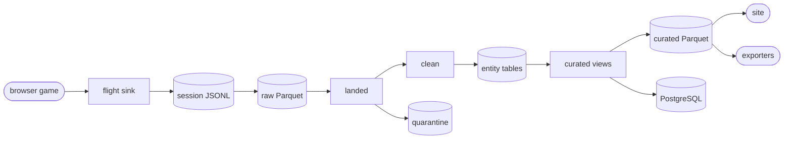
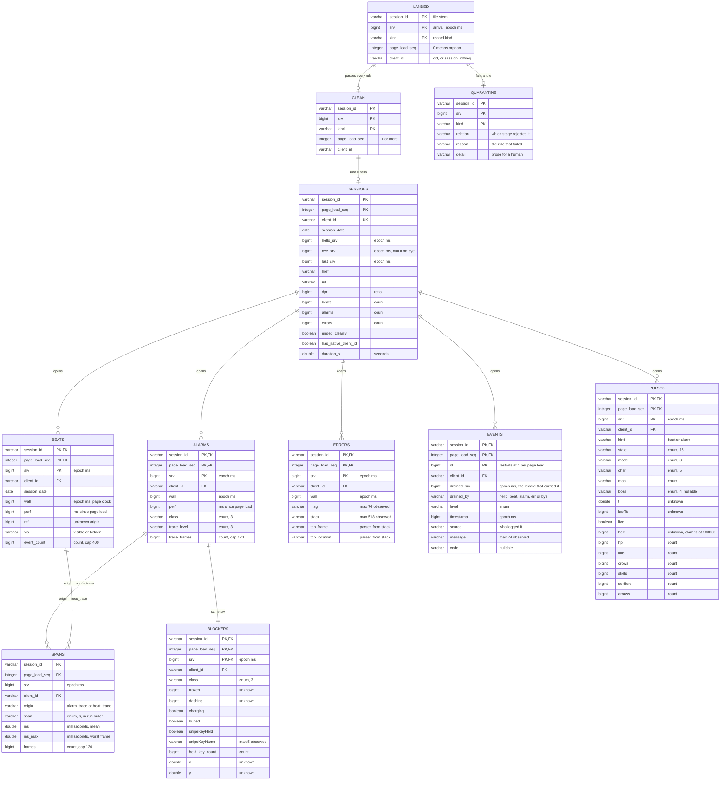

# flightdeck — High-Level Architecture Document

Version: 1.0   Status: Draft   Date: 2026-09-09
Author: alex   Reviewers: none

---

## 1. Purpose and Scope

A browser game writes a flight log while somebody plays it. The page that writes
that log can report the wrong time. It can freeze, sleep, or run in a background
tab that the browser slows down. This system reads the log, checks every record
against a written contract, and publishes the result as open Parquet.

In scope: ingestion, the contract, the relational model, and the three consumers.
Out of scope: the game itself, the recorder inside it, and the sink that receives
the HTTP posts. Those live in the `crow-archer` repository.

> **Decision.** The pipeline orders every record on `srv`, the arrival timestamp
> the sink writes. The page cannot influence `srv`. The rejected alternative was
> `wall`, the page clock, which a frozen or sleeping machine reports wrongly.

---

## 2. End-to-End Flow



| # | Step | Reads | Writes | Rule it applies |
|---|---|---|---|---|
| 1 | The recorder posts a batch | game state | HTTP body | At most 1,000,000 bytes per body |
| 2 | The sink appends one JSON object per line | HTTP body | `fixtures/raw/*.jsonl` | The sink stamps `srv` on arrival |
| 3 | `00_raw.sql` reads the JSONL under a fixed column set | JSONL, `wire_schema.jsonl` | `warehouse/raw/**/*.parquet` | One record of each kind fixes the columns |
| 4 | `10_typed.sql` builds `landed` | `raw` | `landed` view | A `hello` increments `page_load_seq`. `client_id` falls back to `session_id#seq` |
| 5 | `10_typed.sql` writes `quarantine` | `landed` | `quarantine` table | Ten contract rules, each with a reason |
| 6 | `10_typed.sql` defines `clean` | `landed`, `quarantine` | `clean` view | `clean` is `landed` minus `quarantine` |
| 7 | `10_typed.sql` unnests `clean` into eight entities | `clean` | 8 tables | Four nested columns flatten into child rows |
| 8 | `20_curated.sql` defines eleven views | entities | views | Every business number lives here, and only here |
| 9 | `25_publish.sql` copies fifteen relations to Parquet | views, tables | `warehouse/curated/*.parquet` | ZSTD compression |
| 10 | `30_load_postgres.py` loads twelve relations | Parquet | PostgreSQL | An explicit relation list, no globbing |
| 11 | `40_export.py` prints payloads in three formats | Parquet | stdout, files | The exporter makes no network call |
| 12 | The site queries the Parquet in the browser | Parquet | rendered page | The site holds no query the pipeline holds |

> **Warning.** Step 4 is the subtle one. A session file is not a page load. The
> sink writes one file per dev server run. One file holds every page load of that
> run. Event ids restart at 1 on each page load, so the file name keys nothing on
> its own. The fixtures hold 16 page loads across 3 files.

---

## 3. Object Inventory

Row counts come from the three fixture sessions. Observed ranges come from the
same data, so a wider range is possible in production.

### 3.1 Relations

| Relation | Kind | Rows | Grain |
|---|---|---|---|
| `raw_landed` | view | 1260 | one record |
| `raw` | view | 1260 | one record |
| `landed` | view | 1260 | one record |
| `quarantine` | table | 1 | one rejected record |
| `clean` | view | 1259 | one accepted record |
| `sessions` | table | 16 | one page load |
| `beats` | table | 1226 | one heartbeat |
| `pulses` | table | 1230 | one game-state snapshot |
| `events` | table | 2079 | one log entry |
| `alarms` | table | 4 | one watchdog trip |
| `blockers` | table | 4 | one input snapshot at an alarm |
| `errors` | table | 2 | one uncaught exception |
| `spans` | table | 4002 | one frame section in one trace summary |
| `ref_states` | view | 15 | one documented app state |
| `ref_modes` | view | 3 | one documented mode |
| `ref_chars` | view | 5 | one documented character |
| `ref_bosses` | view | 4 | one documented boss |
| `contract_caps` | table | 3 | one cap |

### 3.2 Columns, by unit family

The database carries no unit metadata. The units below come from the source
named in the last column.

| Unit | Columns | Type | Observed range | Source |
|---|---|---|---|---|
| Epoch milliseconds | `srv`, `wall`, `hello_srv`, `hello_wall`, `bye_srv`, `last_srv`, `prev_srv`, `drained_srv`, `events.timestamp` | BIGINT | 1788101912791 to 1788122382071 | Inferred. `srv / 1000` reads as 2026-08-30 22:39 UTC |
| Milliseconds since page load | `perf` | BIGINT | 1072 to 17424492 | Inferred from magnitude |
| Milliseconds | `spans.ms`, `spans.ms_max` | DOUBLE | 0.0025 to 6.1 | `20_curated.sql` names them |
| Seconds | `duration_s`, `gap_s`, `s_since_previous` | DOUBLE | 0.0 to 17424.0 | The suffix, and a division by 1000 in the SQL |
| Count | `beats`, `alarms`, `errors`, `event_count`, `trace_frames`, `spans.frames`, `held_key_count`, `hp`, `kills`, `crows`, `skels`, `soldiers`, `arrows` | BIGINT | see 3.3 | Inferred |
| Ordinal | `page_load_seq` | INTEGER | 1 to 6 | Contract invariant `page_load_opens_with_hello` |
| Ordinal | `events.id` | BIGINT | 1 to 845 | Restarts at 1 on each page load |
| Ratio | `dpr` | BIGINT | 1 to 1 | Device pixel ratio |
| Unknown | `pulses.t`, `pulses.lastTs`, `pulses.held`, `blockers.frozen`, `blockers.dashing`, `blockers.x`, `blockers.y`, `beats.raf` | mixed | see 3.4 | No source |

### 3.3 Caps and observed maxima

| Column | Cap | Cap source | Observed max |
|---|---|---|---|
| `beats.event_count` | 400 | `contract_caps` | 32 |
| `alarms.trace_frames` | 120 | `contract_caps` | 120 |
| `spans.frames` | 120 | `contract_caps` | 120 |
| events per `bye` | 100 | `contract_caps` | 1 |
| logger ring capacity | 500 | `flight_log.yml` only | not measurable |
| HTTP body bytes | 1000000 | `flight_log.yml` only | not measurable |

> **Warning.** `contract_caps` holds three of the five caps that
> `contracts/flight_log.yml` declares. `logger_ring_capacity` and
> `sink_body_bytes` never reach the database. No query can check them.

### 3.4 Observed maximum length, VARCHAR columns

DuckDB VARCHAR declares no length limit. The values below record observed maxima,
not constraints.

| Column | Max length | Example value |
|---|---|---|
| `session_id` | 24 | `2026-08-30T14-58-28-391Z` |
| `client_id` | 26 | `2026-08-30T14-58-28-391Z#1` |
| `href` | 17 | `http://localhost/` |
| `ua` | 6 | `Chrome` |
| `errors.msg` | 74 | an uncaught TypeError message |
| `errors.stack` | 518 | a multi-frame stack trace |
| `errors.top_frame` | 31 | `PathScheduler.invalidateThrough` |
| `errors.top_location` | 20 | `pathfinding.ts:67:30` |
| `events.message` | 74 | as `errors.msg` |
| `events.source` | 12 | `recorder` |
| `events.code` | 12 | `uncaught` |
| `quarantine.detail` | 51 | `record precedes the first hello in its session file` |
| `pulses.map` | 6 | `forest` |
| `blockers.snipeKeyName` | 5 | `Shift` |

> **Note.** The sanitizer rewrites `href` and `ua` before the fixtures reach the
> repository. Production values run longer.

### 3.5 Enumerated domains

| Column | Members | Nullable |
|---|---|---|
| `kind` | `hello`, `beat`, `alarm`, `err`, `bye` | no |
| `vis` | `visible`, `hidden` | no on beats |
| `state` | 15 members | no |
| `mode` | `brawl`, `waves`, `siege` | no |
| `char` | `archer`, `wizard`, `knight`, `ranger`, `sapper` | no |
| `boss` | `crowking`, `dark_archer`, `dark_knight`, `minotaur` | yes |
| `alarm_class` | `loop-dead`, `logic-freeze`, `no-frames` | no |
| `trace_level` | `off`, `time`, `ops` | no |
| `span` | `sim`, `tiles`, `fog`, `bodies`, `vignette`, `hud` | no |
| `spans.origin` | `alarm_trace`, `beat_trace` | no |

---

## 4. Entity Relationship Model

No relation declares a constraint. DuckDB enforces none here. The keys below are
the keys the pipeline joins on. Section 4.2 records which ones hold.



> **Note.** `PK,FK` marks a column that belongs to the primary key and also
> references `sessions`. Mermaid 10 and 11 both parse the comma form.

### 4.1 Cardinality notes

| Pair | Cardinality | Reason |
|---|---|---|
| `sessions` to `beats` | 1 to many | 16 page loads carry 1226 beats |
| `sessions` to `pulses` | 1 to many | Both `beat` and `alarm` carry a pulse. 1226 plus 4 equals 1230 |
| `alarms` to `blockers` | 1 to 1 | Every alarm carries exactly one blocker snapshot |
| `alarms` to `spans` | 1 to 6 | One trace, six frame sections. 4 alarms yield 24 rows |
| `beats` to `spans` | 1 to 0, 6 or 12 | A beat yields spans only when the tracer drained a summary |
| `landed` to `clean` | 1 to 0 or 1 | 1259 of 1260 records pass |
| `landed` to `quarantine` | 1 to 0 or 1 | 1 of 1260 records fails |

### 4.2 Key verification

Each candidate key below ran a `count(*)` against a `count(DISTINCT ...)`.

| Relation | Candidate key | Rows | Distinct | Holds |
|---|---|---|---|---|
| `clean` | `session_id`, `srv`, `kind` | 1259 | 1259 | yes |
| `sessions` | `session_id`, `page_load_seq` | 16 | 16 | yes |
| `beats` | `session_id`, `page_load_seq`, `srv` | 1226 | 1226 | yes |
| `pulses` | `session_id`, `page_load_seq`, `srv` | 1230 | 1230 | yes |
| `events` | `session_id`, `page_load_seq`, `id` | 2079 | 2079 | yes |
| `alarms` | `session_id`, `page_load_seq`, `srv` | 4 | 4 | yes |
| `blockers` | `session_id`, `page_load_seq`, `srv` | 4 | 4 | yes |
| `errors` | `session_id`, `page_load_seq`, `srv` | 2 | 2 | yes |
| `spans` | `session_id`, `page_load_seq`, `srv`, `span`, `origin` | 4002 | 3984 | **no** |

> **Warning.** `spans` has no primary key. One beat can drain two trace
> summaries. Three beats did, so 18 rows collide. At `srv = 1788102057802` the
> `hud` section appears twice, with `ms_max` 0.4 and 0.2. The two rows describe
> different frame windows. Event ids 24 and 25 tell them apart, and `spans`
> carries neither. Section 6 tracks the fix.

---

## 5. One Record, End to End

Five records, each traced from the wire to a curated view. Together they cover
the five record kinds and both outcomes of the contract check.

### 5.1 A `hello` opens a page load

```json
{"kind":"hello","wall":1788101911786,"href":"http://localhost/","ua":"Chrome","dpr":1,"srv":1788101911788}
```

| Stage | Result |
|---|---|
| `raw` | The same fields, plus `session_id` from the file name |
| `landed` | `page_load_seq` becomes 1. `client_id` becomes `2026-08-30T14-58-28-391Z#1`. `has_native_client_id` becomes false |
| `clean` | Passes. `hello` requires `wall`, `href`, `ua` and `dpr`, and all four arrived |
| `sessions` | One row. `hello_srv` 1788101911788, `bye_srv` 1788102120912, `beats` 209, `alarms` 1, `errors` 1, `ended_cleanly` true, `duration_s` 209.1 |
| `session_summary` | The page load, with how it ended |

The wire carries no session identifier. The file name supplies it. The `#1`
suffix exists because this recorder build sends no `cid`.

### 5.2 A `beat` fans out into four relations

```json
{"kind":"beat","wall":1788101912790,"perf":1901,"raf":5,"vis":"visible",
 "pulse":{"state":"menu","mode":"brawl","map":"forest","char":"archer","t":0,
          "lastTs":1366,"live":true,"held":0,"hp":9,"kills":0,"crows":0,
          "skels":0,"soldiers":0,"arrows":0,"boss":null},
 "events":[{"id":1,"level":"info","timestamp":1788101912236,"source":"recorder","message":"tab visible"},
           {"id":2,"level":"info","timestamp":1788101912292,"source":"recorder","message":"flight recorder on"}],
 "srv":1788101912791}
```

| Stage | Result |
|---|---|
| `clean` | One row. `pulse` stays a STRUCT, `events` stays a LIST |
| `beats` | One row. `srv` 1788101912791, `perf` 1901, `raf` 5, `vis` visible, `event_count` 2 |
| `pulses` | One row. `state` menu, `char` archer, `hp` 9, `kills` 0 |
| `events` | Two rows. Ids 1 and 2, both `drained_by` beat |
| `spans` | No rows. This beat carried no trace summary |
| `loss_accounting` | 2079 events received, 0 lost, peak 32 against the 400 cap, 8 percent |

One wire record becomes four relational rows. That fan-out is the reason the
entity tables exist. `clean` alone would force every consumer to unnest.

> **Warning.** `perf` reads 1901 and `raf` reads 5. The two do not share an
> origin. Across the fixtures `perf` reaches 17424492 while `raf` stops at 58970.
> A consumer that subtracts one from the other gets a meaningless number.

### 5.3 An `alarm` carries a trace

```json
{"kind":"alarm","class":"logic-freeze","wall":1788102043292,"perf":132403,
 "pulse":{"state":"playing","held":99877,"hp":9,"crows":9},
 "blockers":{"frozen":0,"charging":false,"dashing":0,"buried":false,
             "snipeKeyHeld":false,"snipeKeyName":"Shift","heldKeys":[],"x":80,"y":528},
 "trace":{"level":"time","frames":119,
          "spans":{"sim":{"ms":0.00672,"msMax":0.1},
                   "tiles":{"ms":0.13697,"msMax":0.7},
                   "hud":{"ms":0.16220,"msMax":3.9}}},
 "srv":1788102043293}
```

| Stage | Result |
|---|---|
| `alarms` | One row. `class` logic-freeze, `trace_level` time, `trace_frames` 119 |
| `blockers` | One row, same `srv`. Every numeric blocker reads 0 |
| `pulses` | One row, `kind` alarm |
| `spans` | Six rows, `origin` alarm_trace. `hud` 0.1622 ms mean, 3.9 ms worst |
| `alarms_by_class` | The alarm, joined to its blockers and its pulse |
| `incident_timeline` | 105.09 seconds after the error in 5.4 |

The watchdog fired while the render loop still ran under 4 ms. The frame times
say the renderer stayed healthy. The alarm class says the game logic did not.

### 5.4 An `err` records an uncaught exception

```json
{"kind":"err","wall":1788101938201,
 "msg":"Uncaught Error: flight-recorder self-test",
 "stack":"Error: flight-recorder self-test\n    at <anonymous>:1:27",
 "events":[{"id":6,"level":"error","timestamp":1788101938201,"source":"window",
            "message":"Uncaught Error: flight-recorder self-test","code":"uncaught"}],
 "srv":1788101938203}
```

| Stage | Result |
|---|---|
| `errors` | One row. `top_frame` and `top_location` parse out of `stack` |
| `events` | One row. Id 6, `drained_by` err, `code` uncaught |
| `error_report` | The error, ordered by `srv` |
| `incident_timeline` | The first incident of that page load |

The gap between `wall` 1788101938201 and `srv` 1788101938203 is 2 milliseconds.
That is the transit time from the page to the sink.

### 5.5 A `bye` arrives before any `hello`

```json
{"kind":"bye","wall":1788104384031,"events":[],"srv":1788104384032}
```

| Stage | Result |
|---|---|
| `landed` | `page_load_seq` becomes 0. No `hello` preceded this record in its file |
| `quarantine` | One row. `reason` `orphan_record_no_hello` |
| `clean` | Absent. `clean` excludes every quarantined record |
| `contract_reconciliation` | 1259 clean plus 1 quarantined equals 1260 landed |

The pipeline drops nothing. The record survives with a reason attached, and the counts
still add up. That is the point of the quarantine relation.

---

## 6. Open Questions and Risks

| ID | Question or risk | Owner | Status |
|---|---|---|---|
| 1 | `spans` has no primary key. Add the source event id to the beat_trace branch | pipeline | Open, needs approval |
| 2 | `logger_ring_capacity` and `sink_body_bytes` never reach `contract_caps` | pipeline | Open, needs approval |
| 3 | `contracts/flight_log.yml` records no units. Add a `columns:` block | contract | Open, needs approval |
| 4 | `beats.raf` has an undocumented origin and disagrees with `perf` | crow-archer | Open, external |
| 5 | `pulses.t`, `pulses.lastTs` and `pulses.held` have no documented unit | crow-archer | Open, external |
| 6 | `blockers.frozen`, `blockers.dashing`, `blockers.x` and `blockers.y` have no documented unit | crow-archer | Open, external |
| 7 | `blockers.frozen` and `blockers.dashing` read 0 in every fixture row | fixtures | Open, no evidence |
| 8 | Observed ranges come from 3 sessions. A wider range is likely | fixtures | Accepted |

---

## Appendix A — Glossary

| Term | Definition |
|---|---|
| Cap | A maximum the contract declares, such as 400 events per beat |
| Clean | The relation holding every record that passed the contract |
| Contract | `contracts/flight_log.yml`, the enums, caps and required fields |
| Curated view | A view in `20_curated.sql`. Every business number lives here |
| Landed | The relation holding every record read from the raw Parquet |
| Page load | One `hello` and everything after it, until the next `hello` |
| Pulse | A snapshot of game state, carried by a beat or an alarm |
| Quarantine | The relation holding every record that failed the contract |
| Session file | One JSONL file, written by one dev server run |
| Span | One section of the render frame, such as `sim` or `hud` |
| `srv` | The arrival timestamp the sink writes. The one clock the page cannot set |
| Trace summary | Per-span frame timings over a window of up to 120 frames |
| `wall` | The page clock, `Date.now()` when the recorder built the record |
