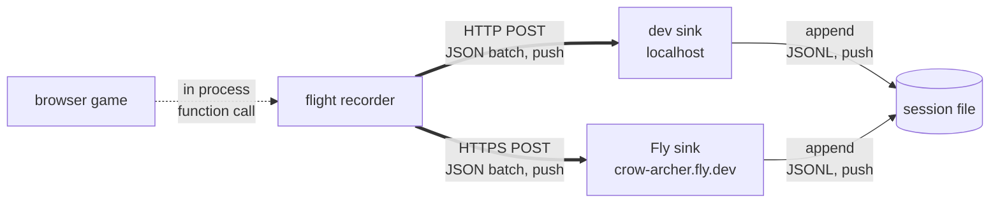
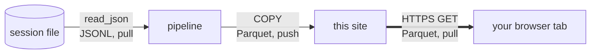

# flightdeck

A [browser game](https://mrbisonte.github.io/crow-archer/) keeps a flight log while you play. This project reads that log,
checks it against a written contract, and publishes the result as open Parquet.

Reading the log is not the hard part. Trusting it is.

```
   the page says when it happened   -->   a claim
   the server says when it arrived  -->   a fact
```

A page can report the wrong time. It can freeze, or sleep with the machine, or
run in a background tab that the browser slows down to save power. So the
pipeline orders every record on the one clock the page cannot write, and treats
the other three as claims to check.

## Nothing is dropped

The pipeline does not delete a record that breaks the contract. It moves that
record to quarantine, with a reason. So the two parts must add up to the whole,
and the pipeline reports whether they do.

```sql echo id=recon
SELECT clean_records::INTEGER       AS clean,
       quarantined_records::INTEGER AS quarantined,
       landed_records::INTEGER      AS landed,
       reconciles
FROM contract_reconciliation
```

```js
const r = recon.get(0);
display(html`<div class="card">
  <h2>clean + quarantined = landed</h2>
  <span class="big">${r.clean} + ${r.quarantined} = ${r.landed}</span>
  <p>${r.reconciles
    ? "The counts reconcile. The pipeline lost nothing."
    : "The counts do not reconcile. Records are missing."}</p>
</div>`);
```

<div class="only-engineering">

That number is the result of the query above it, and so is every number on this
site. There are no hardcoded values typed into the text.

</div>
<div class="only-dashboard">

That number is the result of a query, and so is every number on this site. The
queries are hidden in this view. Switch to Engineering, top right, to read them.

</div>

## How the data gets here

Thick lines mean a network protocol while solid lines are two processes on one
machine passing a file between them. Dotted lines never leave the process.
Labels read `[transport]` then `[format]` then `[who starts]`.

The game writes the log.



The pipeline reads it.



The sink adds the arrival time as it writes. The pipeline calls that column
`srv`, and it is the server clock in the two lines further up this page.

The sample on this site came from the dev sink. The published game posts to the
Fly sink only when you open it with `?rec=1`, so a passer by records nothing.
No capture from there has reached this pipeline yet.

## What is on this site

| Page | What it answers |
|---|---|
| [Overview](./overview) | Is the data sound and how fresh is it |
| [Four clocks](./four-clocks) | Which clock to trust and what the quiet gaps mean |
| [The game](./game) | What actually happened in the play sessions |
| [Governance](./governance) | Who decided what a value means and what the data never exercised |
| [Explore](./explore) | Your own SQL over the same Parquet in your own browser |

## What this is not

This is a demonstration of the method, not a large study. The sample is small,
and the Overview page prints how small, from a query over the published Parquet.

A number the pipeline does not publish is a number this site cannot show. A page
reads that Parquet and may count and rank what it holds, but it adds no source
of its own.
