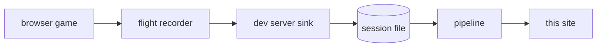

# flightdeck

A browser game keeps a flight log while you play. This project reads that log,
checks it against a written contract, and publishes the result as open Parquet.

Reading the log is not the hard part. Trusting it is.

```
   the page says when it happened   -->   a claim
   the server says when it arrived  -->   a fact
```

A page can report the wrong time. It can freeze, or sleep with the machine, or
run in a background tab that the browser slows down to save power. So the
pipeline orders every record on the one clock the page cannot write, and treats
the other three as claims to check.

## Nothing is dropped

The pipeline does not delete a record that breaks the contract. It moves that
record to quarantine, with a reason. So the two parts must add up to the whole,
and the pipeline reports whether they do.

```sql echo id=recon
SELECT clean_records::INTEGER       AS clean,
       quarantined_records::INTEGER AS quarantined,
       landed_records::INTEGER      AS landed,
       reconciles
FROM contract_reconciliation
```

```js
const r = recon.get(0);
display(html`<div class="card">
  <h2>clean + quarantined = landed</h2>
  <span class="big">${r.clean} + ${r.quarantined} = ${r.landed}</span>
  <p>${r.reconciles
    ? "The counts reconcile. The pipeline lost nothing."
    : "The counts do not reconcile. Records are missing."}</p>
</div>`);
```

That number is the result of the query above it, and so is every number on this
site. There are no hardcoded values typed into the text.

## How the data gets here



The sink adds the arrival time as it writes. The pipeline calls that column
`srv`, and it is the server clock in the two lines further up this page.

## What is on this site

| Page | What it answers |
|---|---|
| [Overview](./overview) | Is the data sound, and how fresh is it |
| [Four clocks](./four-clocks) | Which clock to trust, and what the quiet gaps mean |

## What this is not

The sample is small. The Overview page prints how small, from a query. Read
these pages as a demonstration of the method, not as a large study.

The pipeline holds every query. This site holds none of them. A page here
selects, casts, orders and formats what the pipeline published, and nothing
more. A number the pipeline does not publish is a number this site cannot show.
